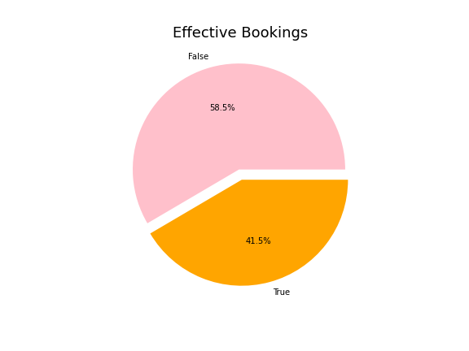
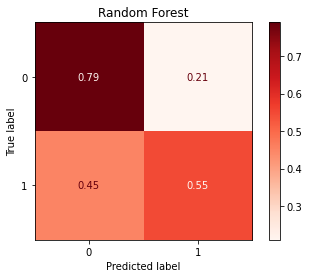

# Capstone Project: Analyzing Airbnb New User Bookings

**Author**: Andrea Cabello

## Abstract

We examined Airbnb demand, among first time users from the USA. 
The data was provided in the form of multiple data sets by Airbnb itself as a challenge on Kaggle.
I grabbed the train_data set provided and performed my own train_test_split.
We created a feature "effective_booking" with values True or False and built a binary classification model (random forest model) to predict if a customer will end up booking or not.
what is happening? what defines if a customer ends up booking or not at a granular or overall level?
We discovered only 42% of users end up booking and explored what could be causing this.
Then we built a classifier using a XGBoost model to predict of those who book where are they going? obtaining a 87.59% validation Accuracy Score.

## Business Problem

1. Predict whether a new airbnb user will effectively book a destination or not.
2. Predict which country a new airbnb user's first booking destination will be.
***

## Data

https://www.kaggle.com/c/airbnb-recruiting-new-user-bookings/data

***
* 213451 total observations (users).
* 124543 NDF (no destination found) makes up for more than half of users in our dataset (58%).
* Number of actual bookings: 88908
* US represents domestic travel, which is 70% of all bookings in our data set.
***

## Methods

* OSEMN
* Feature Engineering 
* Random Forest Classifier
* XGBoost Classifier

***

## Results

Training Accuracy for Random Forest: 68.61%
Test Accuracy for Random Forest: 54.1%

***

Training Accuracy for XGB Classifier : 87.56%
Validation accuracy for XBG Classifier: 87.59%

Questions to consider:
* How do you interpret the results?
* How confident are you that your results would generalize beyond the data you have?
***

### True Bookings

### Random Forest

## Conclusions & Future Work

* As the dataset contained new users information, the value 'unknown' appeared often in several categories. Considering this, the fact that we were able to predict destinations with high accuracy is surprisingly good. 
* Our binary classification model could be improved but it is still quite helpful to somewhat understand what are the common traits among first time users that will end up booking a destination vs those who won't.

***

